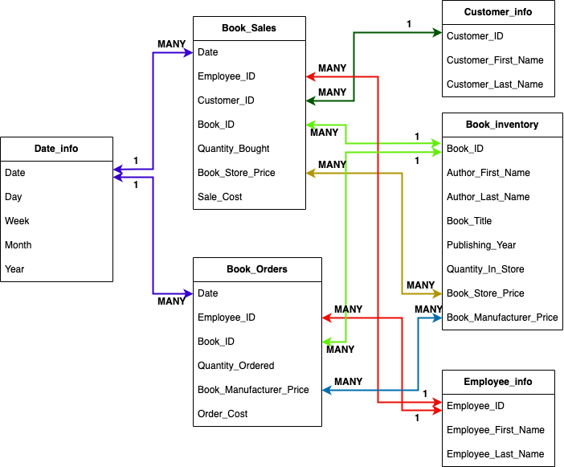
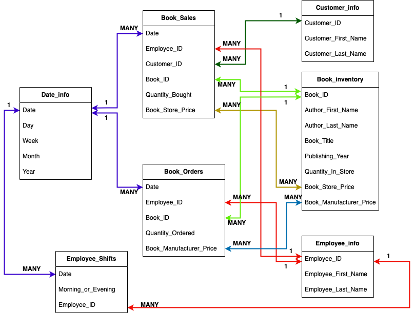
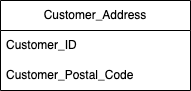
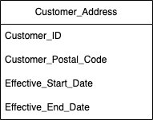

# Assignment 2: Design a Logical Model and Advanced SQL

🚨 **Please review our [Assignment Submission Guide](https://github.com/UofT-DSI/onboarding/blob/main/onboarding_documents/submissions.md)** 🚨 for detailed instructions on how to format, branch, and submit your work. Following these guidelines is crucial for your submissions to be evaluated correctly.

#### Submission Parameters:
* Submission Due Date: `February 1, 2025`
* Weight: 70% of total grade
* The branch name for your repo should be: `assignment-two`
* What to submit for this assignment:
    * This markdown (Assignment2.md) with written responses in Section 1 and 4
    * Two Entity-Relationship Diagrams (preferably in a pdf, jpeg, png format).
    * One .sql file 
* What the pull request link should look like for this assignment: `https://github.com/<your_github_username>/sql/pulls/<pr_id>`
    * Open a private window in your browser. Copy and paste the link to your pull request into the address bar. Make sure you can see your pull request properly. This helps the technical facilitator and learning support staff review your submission easily.

Checklist:
- [ ] Create a branch called `assignment-two`.
- [ ] Ensure that the repository is public.
- [ ] Review [the PR description guidelines](https://github.com/UofT-DSI/onboarding/blob/main/onboarding_documents/submissions.md#guidelines-for-pull-request-descriptions) and adhere to them.
- [ ] Verify that the link is accessible in a private browser window.

If you encounter any difficulties or have questions, please don't hesitate to reach out to our team via our Slack. Our Technical Facilitators and Learning Support staff are here to help you navigate any challenges.

***

## Section 1:
You can start this section following *session 1*, but you may want to wait until you feel comfortable wtih basic SQL query writing. 

Steps to complete this part of the assignment:
- Design a logical data model
- Duplicate the logical data model and add another table to it following the instructions
- Write, within this markdown file, an answer to Prompt 3


###  Design a Logical Model

#### Prompt 1
Design a logical model for a small bookstore. 📚

At the minimum it should have employee, order, sales, customer, and book entities (tables). Determine sensible column and table design based on what you know about these concepts. Keep it simple, but work out sensible relationships to keep tables reasonably sized. 

Additionally, include a date table. 

There are several tools online you can use, I'd recommend [Draw.io](https://www.drawio.com/) or [LucidChart](https://www.lucidchart.com/pages/).

**HINT:** You do not need to create any data for this prompt. This is a conceptual model only. 

#### Answer:



#### Prompt 2
We want to create employee shifts, splitting up the day into morning and evening. Add this to the ERD.

#### Answer:



#### Prompt 3
The store wants to keep customer addresses. Propose two architectures for the CUSTOMER_ADDRESS table, one that will retain changes, and another that will overwrite. Which is type 1, which is type 2? 

**HINT:** search type 1 vs type 2 slowly changing dimensions. 

#### Answer:

A type one slowly changing dimension overwrites existing data if a value of that data changed. For my Type 1 customer address table, I included two columns: Customer_ID and Customer_Postal_Code. The Customer_ID is the unique identifier for each book store customer and the Customer_Postal_Code is meant to represent the customer address. For the sake of simplicity, I included only a single column to represent the customer address, but this information would likely be split into many columns such as house number, street, city, etc. Here, a change to a customer address would overwrite the Customer_Postal_Code column and the historical data would be lost. An image of what this table might look like can be seen below:



A type two slowly changing dimension writes any changes to column values as their own separate rows so that it is possible to track how the data has changed overtime or, in this case, to track when a customer address changes. For my Type 2 customer address table, I included four columns: Customer_ID, Customer_Postal_Code, Effective_Start_Date and Effective_End_Date. As with the Type 1 table, the Customer_ID and Customer_Postal_Code columns represent the unique customer identifiers and the customer addresses respectively. The Effective_Start_Date column indicates the date that the data was inputted into the database and the Effective_End_Date represents some arbitrarily far away date working under the assumption that the customer will always have a particular address. However, if a customer's address changes, these latter two rows allow for the inclusion of a new address while keeping the old one. Here, the addition of a new address for a particular customer ID will cause the Effective_End_Date of the old address to change to the date that the address changed and was added to the system. The new address will have an Effective_Start_Date equivalent to the day the change was made and added to the system and an Effective_End_Date will be the original arbitrarily far away date again working under the assumption that this new address will not change. An image of what this table might look like can be seen below:



***

## Section 2:
You can start this section following *session 4*.

Steps to complete this part of the assignment:
- Open the assignment2.sql file in DB Browser for SQLite:
	- from [Github](./02_activities/assignments/assignment2.sql)
	- or, from your local forked repository  
- Complete each question


### Write SQL

#### COALESCE
1. Our favourite manager wants a detailed long list of products, but is afraid of tables! We tell them, no problem! We can produce a list with all of the appropriate details. 

Using the following syntax you create our super cool and not at all needy manager a list:
```
SELECT 
product_name || ', ' || product_size|| ' (' || product_qty_type || ')'
FROM product
```

But wait! The product table has some bad data (a few NULL values). 
Find the NULLs and then using COALESCE, replace the NULL with a blank for the first problem, and 'unit' for the second problem. 

**HINT**: keep the syntax the same, but edited the correct components with the string. The `||` values concatenate the columns into strings. Edit the appropriate columns -- you're making two edits -- and the NULL rows will be fixed. All the other rows will remain the same.

<div align="center">-</div>

#### Windowed Functions
1. Write a query that selects from the customer_purchases table and numbers each customer’s visits to the farmer’s market (labeling each market date with a different number). Each customer’s first visit is labeled 1, second visit is labeled 2, etc. 

You can either display all rows in the customer_purchases table, with the counter changing on each new market date for each customer, or select only the unique market dates per customer (without purchase details) and number those visits. 

**HINT**: One of these approaches uses ROW_NUMBER() and one uses DENSE_RANK().

2. Reverse the numbering of the query from a part so each customer’s most recent visit is labeled 1, then write another query that uses this one as a subquery (or temp table) and filters the results to only the customer’s most recent visit.

3. Using a COUNT() window function, include a value along with each row of the customer_purchases table that indicates how many different times that customer has purchased that product_id.

<div align="center">-</div>

#### String manipulations
1. Some product names in the product table have descriptions like "Jar" or "Organic". These are separated from the product name with a hyphen. Create a column using SUBSTR (and a couple of other commands) that captures these, but is otherwise NULL. Remove any trailing or leading whitespaces. Don't just use a case statement for each product! 

| product_name               | description |
|----------------------------|-------------|
| Habanero Peppers - Organic | Organic     |

**HINT**: you might need to use INSTR(product_name,'-') to find the hyphens. INSTR will help split the column. 

<div align="center">-</div>

#### UNION
1. Using a UNION, write a query that displays the market dates with the highest and lowest total sales.

**HINT**: There are a possibly a few ways to do this query, but if you're struggling, try the following: 1) Create a CTE/Temp Table to find sales values grouped dates; 2) Create another CTE/Temp table with a rank windowed function on the previous query to create "best day" and "worst day"; 3) Query the second temp table twice, once for the best day, once for the worst day, with a UNION binding them. 

***

## Section 3:
You can start this section following *session 5*.

Steps to complete this part of the assignment:
- Open the assignment2.sql file in DB Browser for SQLite:
	- from [Github](./02_activities/assignments/assignment2.sql)
	- or, from your local forked repository  
- Complete each question

### Write SQL

#### Cross Join
1. Suppose every vendor in the `vendor_inventory` table had 5 of each of their products to sell to **every** customer on record. How much money would each vendor make per product? Show this by vendor_name and product name, rather than using the IDs.

**HINT**: Be sure you select only relevant columns and rows. Remember, CROSS JOIN will explode your table rows, so CROSS JOIN should likely be a subquery. Think a bit about the row counts: how many distinct vendors, product names are there (x)? How many customers are there (y). Before your final group by you should have the product of those two queries (x\*y). 

<div align="center">-</div>

#### INSERT
1. Create a new table "product_units". This table will contain only products where the `product_qty_type = 'unit'`. It should use all of the columns from the product table, as well as a new column for the `CURRENT_TIMESTAMP`.  Name the timestamp column `snapshot_timestamp`.

2. Using `INSERT`, add a new row to the product_unit table (with an updated timestamp). This can be any product you desire (e.g. add another record for Apple Pie). 

<div align="center">-</div>

#### DELETE 
1. Delete the older record for the whatever product you added.

**HINT**: If you don't specify a WHERE clause, [you are going to have a bad time](https://imgflip.com/i/8iq872).

<div align="center">-</div>

#### UPDATE
1. We want to add the current_quantity to the product_units table. First, add a new column, `current_quantity` to the table using the following syntax.
```
ALTER TABLE product_units
ADD current_quantity INT;
```

Then, using `UPDATE`, change the current_quantity equal to the **last** `quantity` value from the vendor_inventory details. 

**HINT**: This one is pretty hard. First, determine how to get the "last" quantity per product. Second, coalesce null values to 0 (if you don't have null values, figure out how to rearrange your query so you do.) Third, `SET current_quantity = (...your select statement...)`, remembering that WHERE can only accommodate one column. Finally, make sure you have a WHERE statement to update the right row, you'll need to use `product_units.product_id` to refer to the correct row within the product_units table. When you have all of these components, you can run the update statement.

*** 

## Section 4:
You can start this section anytime.

Steps to complete this part of the assignment:
- Read the article
- Write, within this markdown file, <1000 words.

### Ethics

Read: Boykis, V. (2019, October 16). _Neural nets are just people all the way down._ Normcore Tech. <br>
    https://vicki.substack.com/p/neural-nets-are-just-people-all-the

**What are the ethical issues important to this story?**

Consider, for example, concepts of labour, bias, LLM proliferation, moderating content, intersection of technology and society, ect. 

**ANSWER:**

In the article “Neural nets are just people all the way down”, Vicki Boykis describes how ImageNet—an image training set for AI algorithms—came to exist. While describing the history of this repository and the many levels of human labour necessary to create it, Boykis alludes to several significant ethical issues related to this work and the AI products that come out of it. First and foremost are the ethical issues surrounding labour recognition and labour exploitation. ImageNet and the entities this software is based on—WordNet and the Brown Corpus—are each attributed to one or several major authors/creators. Yet, all of these innovations are actually the product of collaborative interactions with numerous individuals including students, co-workers, spouses and employees just to name a few. While such interactions are common practice in the academic sphere and collaborators are often compensated with payment, work experience or a brief acknowledgement in any resulting publications, the contributions of these individuals are often downplayed particularly in media until they are eventually forgotten altogether. More concerning however, is the potential labour exploitation that may have accompanied the creation of ImageNet. In the article, Boykis describes how Dr. Li—the principal investigator behind ImageNet—utilized Amazon Mechanical Turk as a way to crowdsource image labelling and keep the costs of doing so relatively low. Using this website, Dr. Li had access to an army of workers from across the globe, but she also had no way of knowing the conditions that her anonymous employees were working under. It is very easy to imagine how something like Amazon Mechanical Turk could turn into a kind of digital sweat shop where vulnerable individuals are forced to work on tasks by a local power and do not receive the entirety or any of the money they are supposedly earning. Even in cases where workers are acting independently, there are no means for them to negotiate things like salary with their employers and there are no policies in place that protect workers’ rights and safety. Altogether, Amazon Mechanical Turk as a labour source is a fertile breeding ground for worker exploitation and, based on some the articles that pop up when you google the website, many labour activists agree with this sentiment. The other major ethical issue that Boykis touches upon in her article is the way that human bias and prejudice can affect an AI training set and the outputs from AI algorithms. The ImageNet repository is based on products from three main human-driven sources: the Brown Corpus, WordNet and Amazon Mechanical Turk. By default, each of these sources will have a certain amount of bias and prejudice incorporated into them by their creators and contributors—either willingly or unwillingly—that may not reflect the views of the team behind ImageNet or its users. For example, the Brown Corpus was designed using information collected from American 1960s written products. However, the ideals of the 1960s relating to subjects like gender roles, sexuality, human rights, etc. are extremely different from what they are presently. By utilizing this older information source, the creators of WordNet and, in turn, ImageNet are incorporating 1960s biases into their products that are not reflective of current-day viewpoints. Likewise, WordNet was released in the 1980s and may have biases and prejudices associated with this time period that will also be incorporated into ImageNet. Finally, Amazon Mechanical Turk employs workers from all over the world that represent innumerable social and cultural backgrounds and the biases and prejudices that come with them. While Dr. Li did include a filter to account for workers who were not labeling images as expected, this filter was not designed to account for the possibly divergent ideals of her workforce. So, as a whole, ImageNet incorporated biases from 1960s America, from 1980s America and from the global viewpoints of the 2000s. As a result of these biases, it was found that ImageNet labels associated with humans or the “person” subtree were often offensive and sometimes racist which means that any AI algorithms using these “person-related” training sets would also integrate these issues. Overall, this idea highlights an important problem associated with AI training sets and AI in general. While the collective human consciousness is endlessly dynamic and changing, an AI algorithm can only innovate based on the information included in its training set. These training sets can be updated to reflect changing viewpoints, but they can never truly keep pace with human society meaning that AI outputs will always lag somewhat behind the present-day ideals. With AI being included in more and more services, it is unclear how widespread this potential “lag” is and what the repercussions will be moving forward though the current state of ImageNet with its 1593 “offensive” human labels may offer some insight.

